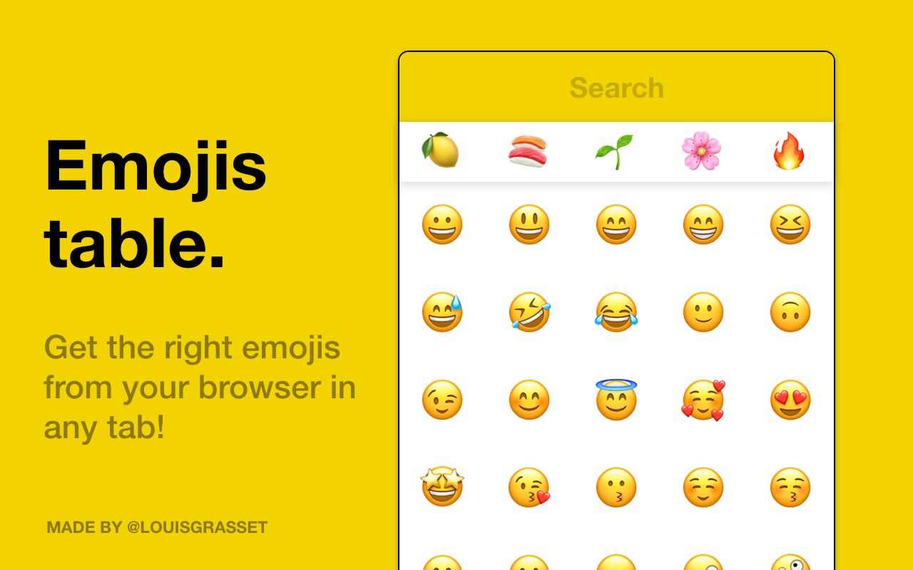

# emojis-table
Get the right emojis from your browser in any tab!

Available here [Firefox Add-ons](https://addons.mozilla.org/firefox/addon/emojis-table/) | [Chrome Web Store](https://chrome.google.com/webstore/detail/lkpflloaceieinnhchbmfefimjliigcj/).

### Build
Just run `npm i` then `npm run build` 

_Do not forget that emojis support is may differ from your operating system : 💻 / 📱 / ⌚._

