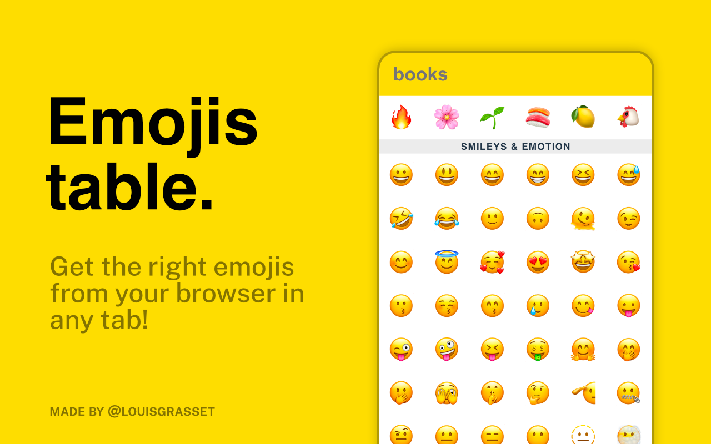
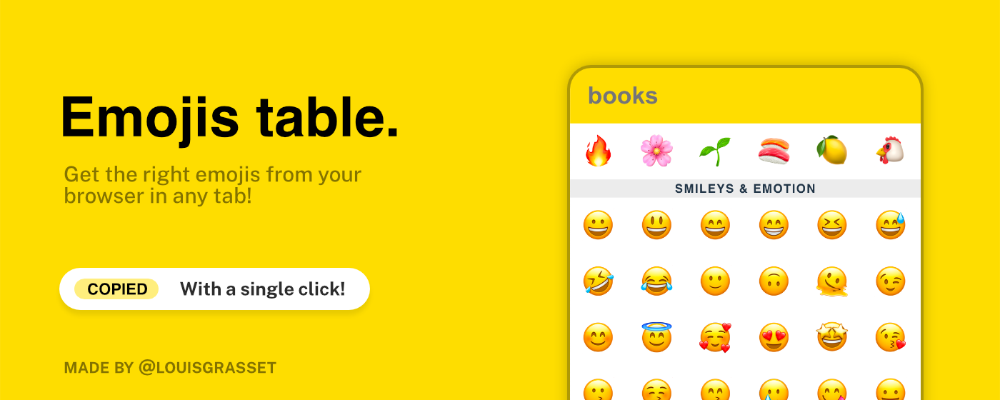

# emojis-table
Get the right emojis from your browser in any tab!

## Browsers support

|  Firefox |  Chromium  |
|-------------------------------------------------------------------------------------------------------------------------------------------------------------------------------------------------------------------|------------------------------------------------------------------------------------------------------------------------------------------------------------------------------------------------------------------|
| Recent version                                                                                                                                                                                                    | Recent version                                                                                                                                                                                                   | 
| [Available here](https://addons.mozilla.org/firefox/addon/emojis-table/)                                                                                                                                          | [Available here](https://chrome.google.com/webstore/detail/lkpflloaceieinnhchbmfefimjliigcj/).|

## Build
Just run `npm install` then either
* `npm run build:firefox` or
* `npm run build:chromium` 

_Do not forget that emojis support is may differ from your operating system : 💻 / 📱 / ⌚._

